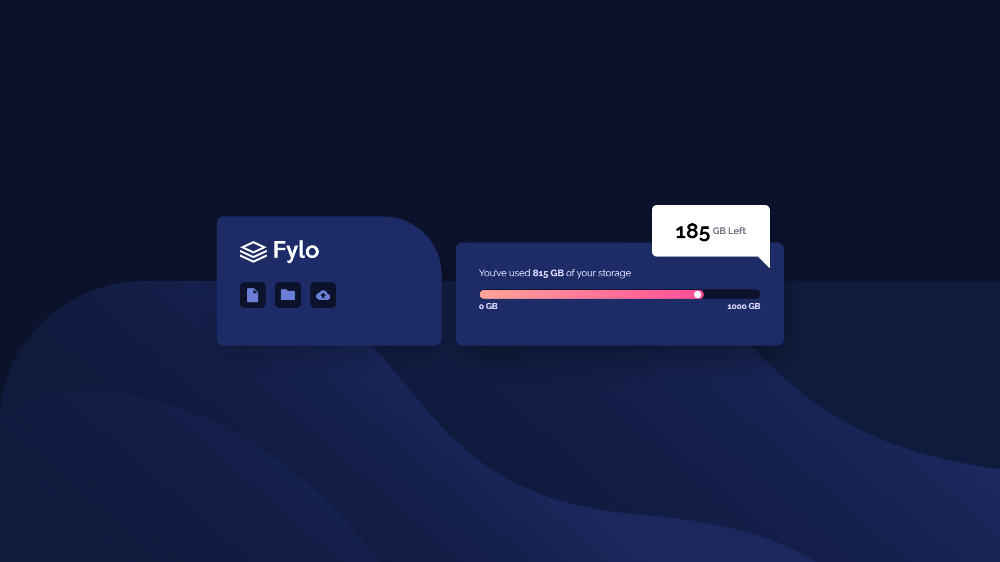
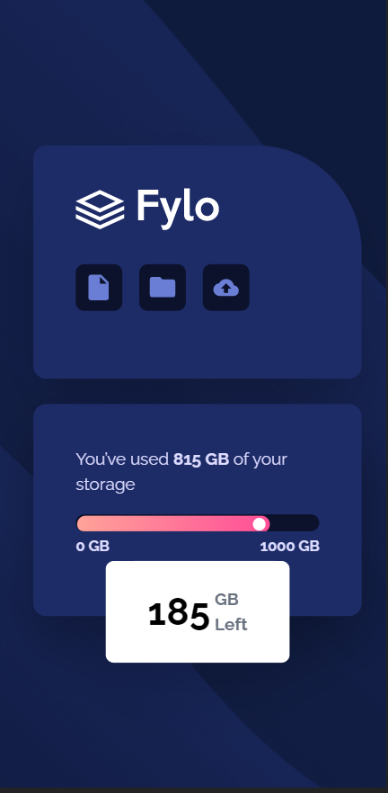

# Frontend Mentor - Fylo data storage component solution

This is a solution to the [Fylo data storage component challenge on Frontend Mentor](https://www.frontendmentor.io/challenges/fylo-data-storage-component-1dZPRbV5n). Frontend Mentor challenges help you improve your coding skills by building realistic projects.

## Table of contents

- [Get Started](#get-started)
- [Overview](#overview)
  - [The challenge](#the-challenge)
  - [Screenshot](#screenshot)
  - [Links](#links)
- [My process](#my-process)
  - [Built with](#built-with)
  - [What I learned](#what-i-learned)
- [Author](#author)

## Get Started

- Download the folder
- Open index.html file in your browser
- If you want to edit tailwindcss code, make these first.
  - `npm i`
  - `npx tailwindcss -i ./src/input.css -o ./styles.css --watch`
  - You can edit now! 🎉

## Overview

### The challenge

Users should be able to:

- View the optimal layout for the site depending on their device's screen size

### Screenshot





### Links

- Solution URL: [https://github.com/boss-is-me/fylo-data-storage-component-frontend-mentor](https://github.com/boss-is-me/fylo-data-storage-component-frontend-mentor)
- Live Site URL: [https://boss-is-me.github.io/fylo-data-storage-component-frontend-mentor/](https://boss-is-me.github.io/fylo-data-storage-component-frontend-mentor/)

## My process

### Built with

- Semantic HTML5 markup
- Flexbox
- [tailwindcss](https://tailwindcss.com/) - For styles

### What I learned

I use this code to center a absolute div
reference - [https://stackoverflow.com/questions/1776915/how-can-i-center-an-absolutely-positioned-element-in-a-div](https://stackoverflow.com/questions/1776915/how-can-i-center-an-absolutely-positioned-element-in-a-div)

```html
<div class="left-1/2 -translate-x-1/2 ..."></div>
```

This code is used to make the tail of chat box

```html
<div class="absolute right-6 -top-16 pb-5 ...">
  <div
    class="w-10 h-10 bg-white rotate-45 absolute -right-5 bottom-2 hidden lg:block"
  ></div>
</div>
```

## Author

- Github - [boss-is-me](https://github.com/boss-is-me)
- Frontend Mentor - [@phonezaw](https://www.frontendmentor.io/profile/phonezaw)
